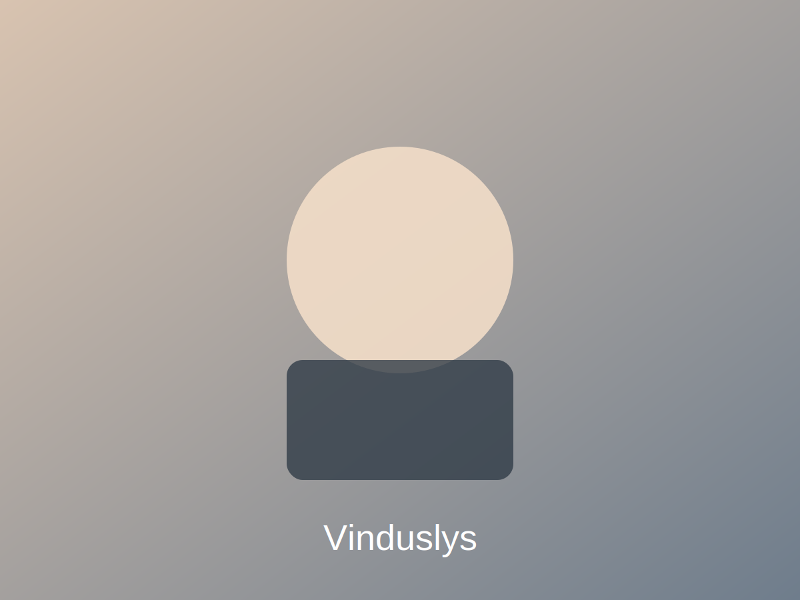
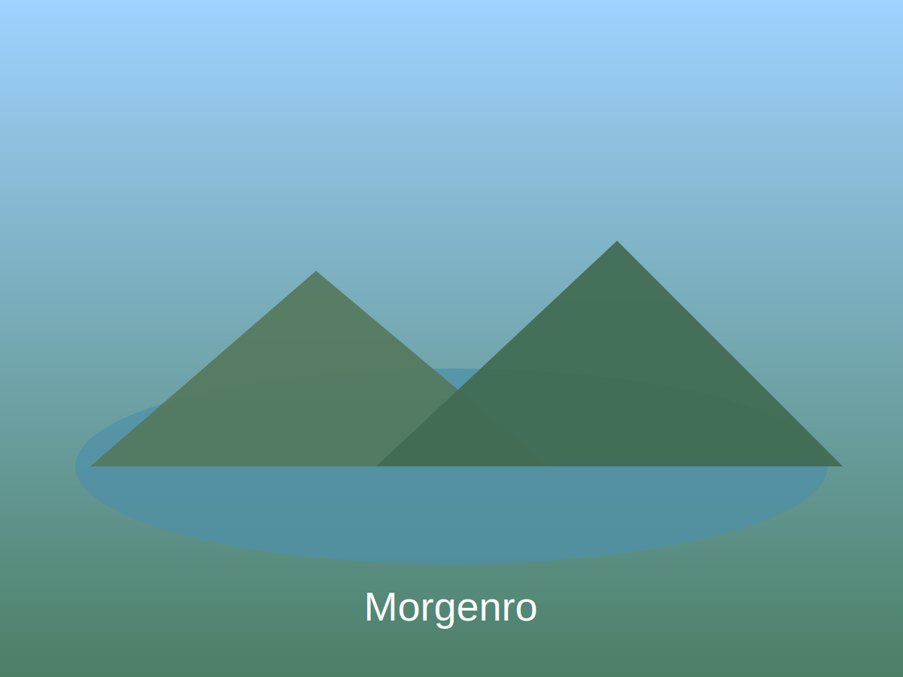
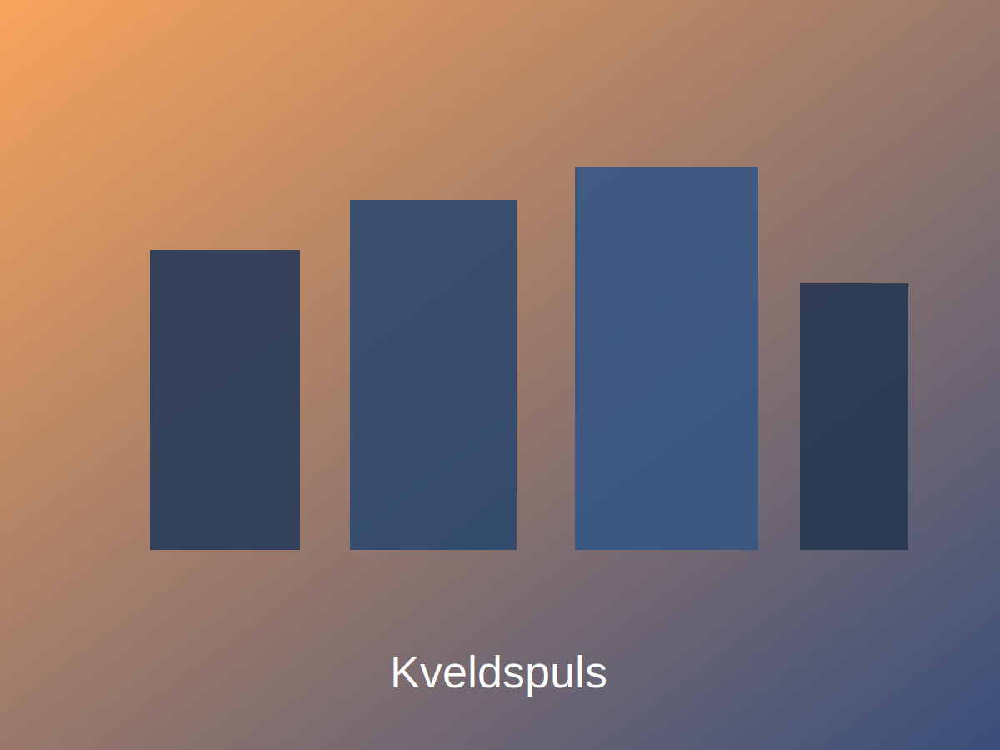

# 📸 Foto-galleri

Dette galleriet er satt opp som en **portefølje** med kuraterte høydepunkter.  
Målet er rask visning på mobil, tydelige miniatyrer, og enkel åpning av større versjon.

## Scope og brukeropplevelse

- Én hovedside med seksjoner per kategori
- Miniatyr-grid for oversikt
- Klikk på miniatyr for større visning
- Konsistent metadata per bilde: tittel, serie, sted, dato, kamera/linse, lisens/kontakt
- Interaksjonsnivå: statisk side + klikk for større visning (uten ekstra plugin)

## Kategorier

- [Portretter](#portretter)
- [Natur](#natur)
- [Reise](#reise)

## Metadata-mal

Bruk dette formatet i bildetekster:

- **Tittel:**
- **Serie:**
- **Sted:**
- **Dato:**
- **Utstyr:**
- **Lisens/kontakt:**

## Portretter

<section class="photo-gallery">
  <article class="photo-card">
    
    
<strong>Tittel:</strong> Vinduslys <strong>Serie:</strong> Portretter 2026 <strong>Sted:</strong> Oslo <strong>Dato:</strong> 2026-06-01 <strong>Utstyr:</strong> Fullformat + 50mm <strong>Lisens/kontakt:</strong> Ta kontakt for bruk

  </article>
</section>

## Natur

<section class="photo-gallery">
  <article class="photo-card">
    
    
<strong>Tittel:</strong> Morgenro <strong>Serie:</strong> Natur 2026 <strong>Sted:</strong> Nordmarka <strong>Dato:</strong> 2026-05-20 <strong>Utstyr:</strong> Fullformat + 24-70mm <strong>Lisens/kontakt:</strong> Ta kontakt for bruk

  </article>
</section>

## Reise

<section class="photo-gallery">
  <article class="photo-card">
    
    
<strong>Tittel:</strong> Kveldspuls <strong>Serie:</strong> Reise 2026 <strong>Sted:</strong> København <strong>Dato:</strong> 2026-04-18 <strong>Utstyr:</strong> Fullformat + 35mm <strong>Lisens/kontakt:</strong> Ta kontakt for bruk

  </article>
</section>

## Booking og kontakt

Ønsker du å booke fotooppdrag eller lisensiere bilder?  
Send en melding med ønsket bruk, tidsrom og sted.
